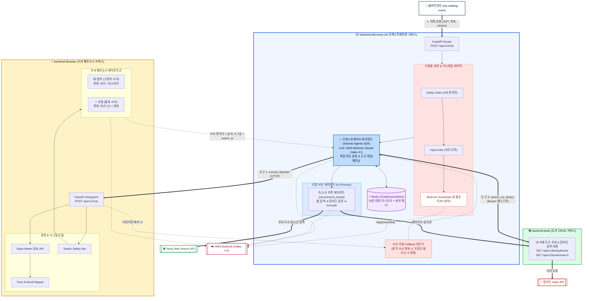
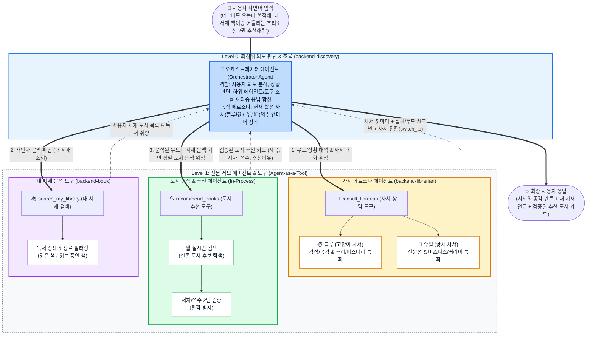
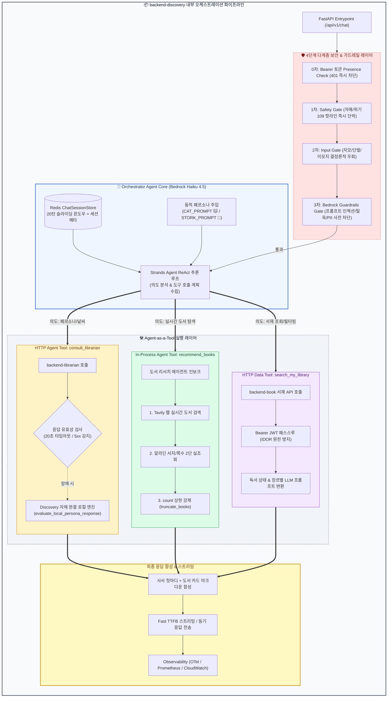

# backend-discovery

DPYB(Don't Paw Get Your Book)의 **AI · 탐색(Discovery) 전담 마이크로서비스**입니다.

Strands Agents SDK와 AWS Bedrock(Claude Haiku 4.5)을 기반으로, 실시간 웹 검색(Tavily)과 내부 마이크로서비스 API 연동을 통해 **도서 추천 · 내 서재 검색 · 사서 상담**을 하나의 대화창에서 원스톱으로 처리하는 AI 오케스트레이션 및 표준 장르 분류 서비스를 제공합니다.

---

## 🏛️ 시스템 아키텍처 & 에이전트 토폴로지

### 1. 시스템 통합 아키텍처 (마이크로서비스 & 인프라 뷰)
디스커버리 오케스트레이터와 사서 에이전트(`backend-librarian`), 도서 CRUD(`backend-book`) 및 외부 API 간의 마이크로서비스 연동 구조입니다.



---

### 2. 순수 에이전트 토폴로지 (Agent-as-a-Tool 뷰)
인프라 세부사항을 배제하고, **오케스트레이터와 서브 에이전트 간의 계층적 역할 분담 및 도구 조율 흐름**을 나타낸 다이어그램입니다.



---

### 3. backend-discovery 내부 상세 파이프라인 (Agent-as-a-Tool 실행 엔진)
오케스트레이터가 **사용자 입력을 분석하여 3개의 Agent-as-a-Tool을 어떻게 호출·합성하는지** 나타낸 상세 실행 파이프라인입니다.



---

## 🛠️ 기술 스택

| 영역 | 기술 | 설명 |
| :--- | :--- | :--- |
| **언어 / 런타임** | Python 3.12, FastAPI (async) | 비동기 고성능 REST API 및 스트리밍 처리 |
| **패키지 관리** | uv (`pyproject.toml`, `uv.lock`) | 초고속 결정론적 의존성 격리 |
| **AI / 에이전트** | Strands Agents SDK | Agent-as-a-Tool 패턴 기반 오케스트레이션 |
| **LLM 추론** | AWS Bedrock (Claude Haiku 4.5) | 글로벌 프로필 (`global.anthropic.claude-haiku-4-5-20251001-v1:0`, `us-east-1`) |
| **외부 검색** | Tavily Web Search API | `search_depth="basic"`, `sanitize_search_results` 페이로드 축소 |
| **서지 검증** | 알라딘 Open API (via backend-book) | 제목·저자 기반 ISBN/총 페이지수 2단 실조회 (환각 방지) |
| **캐시 & 세션** | Redis 7 (`ChatSessionStore`) | 대화 20턴 슬라이딩 윈도우, 세션 메타(좌표/사서ID), 서지 캐시(30일) |
| **보안 & 안전** | AWS Bedrock Guardrails, 109 Safety Gate | 악의적 프롬프트/탈옥/PII 사전 차단, 위기/자해 109 핫라인 즉시 우회 |
| **관측성** | OpenTelemetry + Prometheus + CloudWatch | OTel 트레이싱(Tempo), JSON 로그(Loki), `/metrics`, Bedrock 비용/지연 메트릭 |

---

## 📂 저장소 구조

```text
backend-discovery/
├── src/discovery/
│   ├── main.py                  # FastAPI 앱 팩토리, Lifespan, OTel/미들웨어 등록
│   ├── core/                    # 설정(config), JSON 로깅, 트레이싱(OTel), 메트릭, CloudWatch
│   ├── domain/
│   │   ├── orchestrator/        # 오케스트레이터 에이전트 빌더, 사서별 전용 프롬프트, 도구군
│   │   │   ├── tools/           # recommend_tool, librarian_tool, library_tool
│   │   │   ├── gates/           # safety_gate(109 핫라인), input_gate(자모 단락)
│   │   │   ├── bedrock_guardrail_gate.py  # Amazon Bedrock Guardrails 입력 검증 게이트
│   │   │   └── fallback.py      # 사서 장애 대응 로컬 페르소나 fallback 엔진
│   │   ├── librarian/           # 도서 추천 로컬 에이전트, 후처리기(truncate, sanitize)
│   │   └── genre/               # 도서 16개 표준 장르 분류 프롬프트 및 파서
│   ├── application/             # orchestrator_service, genre_classifier_service
│   ├── infrastructure/
│   │   ├── cache/               # Redis 클라이언트, ChatSessionStore
│   │   └── search/              # Tavily 검색 도구, 캐시, 요청 리미터
│   └── api/
│       ├── deps.py              # 의존성 주입 배선 (DI)
│       ├── schemas/             # ChatRequest/Response, GenreRequest/Response
│       └── v1/routers/          # chat.py, genre.py
├── docs/api/                    # openapi.yaml, ADR 결정 문서
├── k8s/                         # Kubernetes 배포 매니페스트 (base, overlays/dev)
└── tests/                       # 단위 테스트(305건 100% 통과) 및 Redis 통합 테스트
```

---

## 🚀 API 계약 (API Contract)

### 1. POST /api/v1/chat (별칭: /chat)
오케스트레이터와 대화하며, 의도에 따라 도서 추천, 사서 상담, 내 서재 조회를 복합 수행합니다.

**요청 헤더:**
- `Authorization: Bearer <token>` (필수, 사용자 인증 및 서재 연동용)

**요청 바디 (ChatRequest):**
```json
{
  "message": "비도 오는데 울적해, 내 서재 책이랑 어울리는 추리소설 2권 추천해줘",
  "session_id": "optional-uuid",
  "stream": false,
  "latitude": 37.5145,
  "longitude": 127.1058
}
```

**응답 바디 (ChatResponse, stream=false):**
```json
{
  "message": "비 오는 날엔 차분하게 몰입할 수 있는 추리소설이 최고다냥! 서재에 있는 책들을 참고해서 딱 맞는 책으로 선별했다냥 🐾\n\n### 📖 백야행\n- **저자**: 히가시노 게이고 (592쪽)\n- **장르**: LITERARY_FICTION\n- **추천 이유**: 서재에 등록된 도서들과 어우러져 깊은 여운을 주는 대표 명작 추리소설입니다.",
  "session_id": "sess-uuid",
  "switch_to": null,
  "signals": {
    "weather": {"weather": "비", "temperature": 21.0, "is_rainy": true},
    "mood": "gloomy",
    "genre_focus": ["미스터리", "스릴러"]
  },
  "library_books": [],
  "recommended_books": [
    {
      "title": "백야행",
      "author": "히가시노 게이고",
      "total_pages": 592,
      "genre": "LITERARY_FICTION",
      "recommendation_reason": "서재에 등록된 도서들과 어우러져 깊은 여운을 주는 대표 명작 추리소설입니다."
    }
  ]
}
```

*스트리밍(`stream=true`) 시 본문은 SSE 청크로 전달되며 `X-Session-Id`, `X-Signals`, `X-Switch-To`, `X-Library-Books` 헤더가 함께 노출됩니다.*

### 2. POST /api/v1/classify-genre
도서의 ISBN을 분석하여 DPYB ERD 규격 16개 표준 장르 중 1개로 자동 분류합니다.

---

## ⚙️ 주요 환경 변수

| 변수명 | 설명 | 기본값 |
| :--- | :--- | :--- |
| `LLM_PROVIDER` | LLM 구동 엔진 (`bedrock` 또는 `mock`) | `mock` |
| `ORCHESTRATOR_MODEL_ID` | 오케스트레이터 모델 ID (Haiku 4.5) | `global.anthropic.claude-haiku-4-5-20251001-v1:0` |
| `LIBRARIAN_MODEL_ID` | 추천 에이전트 모델 ID | `global.anthropic.claude-haiku-4-5-20251001-v1:0` |
| `LIBRARIAN_AGENT_URL` | 사서 마이크로서비스 URL | `http://localhost:8000` (dev: K8s Service DNS) |
| `LIBRARY_API_URL` | 내 서재 API (backend-book) URL | 클러스터 도메인 |
| `REDIS_HOST` / `PORT` | 세션/캐시 저장소 Redis 접속 정보 | `localhost:6379` |
| `TAVILY_API_KEY` | 실시간 웹 도서 검색 API 키 | - |
| `ENABLE_PROMPT_CACHING` | Bedrock 프롬프트 캐싱 활성화 여부 | `true` |
| `ENABLE_CLOUDWATCH_METRICS`| AWS CloudWatch LLM 커스텀 메트릭 발행 | `false` (dev: `true`) |

---

## 💻 로컬 개발 환경 실행

```bash
# 1. 의존성 동기화
uv sync

# 2. Redis 기동
docker compose up -d redis

# 3. 환경 변수 설정 (.env)
cp .env.example .env

# 4. 서버 기동 (포트 8001)
uv run uvicorn src.discovery.main:app --host 0.0.0.0 --port 8001 --reload

# 5. 검증 (정적 분석 & 단위 테스트)
uv run ruff check .
uv run mypy .
uv run pytest -m "not integration"
```


