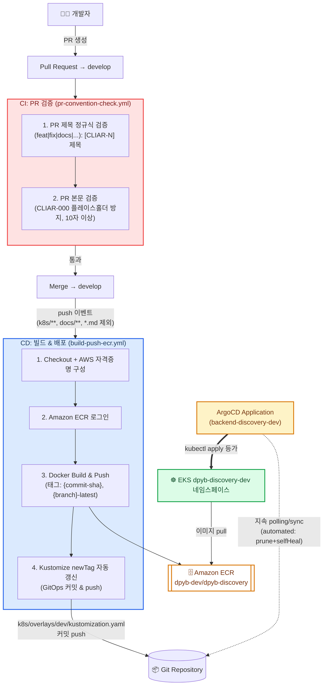

# GitHub Actions & ArgoCD CI/CD 파이프라인 가이드

본 문서는 `backend-discovery`의 코드 변경이 **커밋 → CI 검증 → 컨테이너 이미지 빌드 → GitOps 매니페스트 갱신 → ArgoCD 자동 배포**로 이어지는 전체 CI/CD 파이프라인을 안내합니다.

---

## 1. 📌 개요 및 설계 철학

* **목적**:
  * **PR 컨벤션 강제**: 지라 티켓 번호(`CLIAR-XX`) 및 커밋 타입 표기를 CI에서 기계적으로 검증해 이력 추적성 확보
  * **GitOps 기반 무중단 배포**: 사람이 직접 `kubectl apply`를 실행하지 않고, Git 저장소의 선언적 상태(Kustomize 매니페스트)를 ArgoCD가 지속 감시(sync)하여 클러스터 실제 상태로 수렴
  * **이미지 태그 = 커밋 SHA**: 배포된 이미지가 어떤 커밋에서 빌드되었는지 항상 추적 가능
* **브랜치 전략과의 연결**: `develop` 브랜치 push가 dev 환경 자동 배포를 트리거합니다. `main` 브랜치(prod 배포)는 현재 워크플로우에서 주석 처리되어 있어 비활성 상태입니다.

---

## 2. 🏛️ 전체 파이프라인 아키텍처



---

## 3. 🧪 CI: PR 컨벤션 검증 (`pr-convention-check.yml`)

### 3.1 트리거

`pull_request` 이벤트 (`opened`, `edited`, `synchronize`) — PR이 생성/수정/새 커밋 push될 때마다 재검증됩니다.

### 3.2 검증 단계

**1단계: PR 제목 형식 검증**

```regex
^(feat|fix|docs|style|refactor|test|chore)(\([a-zA-Z0-9_-]+\))?: \[CLIAR-[0-9]+\] .+$
```

* 루트 `README.md`의 커밋 컨벤션(`<타입>[scope]: [CLIAR-N] 제목`)과 동일한 규칙을 PR 제목에도 강제합니다.
* 예: `feat(discovery): [CLIAR-9] 오케스트레이터 스캐폴딩 추가` ✅

**2단계: PR 본문 검증**

* 템플릿의 플레이스홀더(`CLIAR-000`)를 실제 티켓 번호로 바꾸지 않고 그대로 제출하면 실패합니다.
* 본문 길이가 10자 이하이면 실패합니다 (내용 없는 PR 방지).

> ⚠️ 본 CI는 **PR 메타데이터(제목/본문) 검증만** 수행합니다. `ruff check`/`mypy`/`pytest` 같은 코드 품질 검증은 README.md에 정책으로 명시되어 있으나, 현재 `.github/workflows/`에는 별도 워크플로우로 아직 구현되어 있지 않습니다 (`.harness/BACKLOG.md`에 미해결 항목으로 존재).

---

## 4. 🚀 CD: 빌드 & GitOps 배포 (`build-push-ecr.yml`)

### 4.1 트리거

```yaml
on:
  push:
    branches:
      - develop         # develop → dev 환경
      # - main          # main → prod 환경 (주석 처리, 비활성)
    paths-ignore:
      - "k8s/**"        # 태그 갱신 커밋의 무한루프 방지
      - "argocd/**"
      - "docs/**"
      - "**/*.md"
  workflow_dispatch: {}  # 수동 실행 허용
```

* `paths-ignore`가 핵심입니다: 이 워크플로우 자신이 4단계에서 `k8s/overlays/dev/kustomization.yaml`을 커밋하는데, 이 경로가 제외되지 않으면 **커밋이 워크플로우를 재트리거하는 무한루프**가 발생합니다.
* `permissions: contents: write`가 필요합니다 — 이미지 태그 갱신 커밋을 push하기 위함입니다.

### 4.2 실행 단계

| 단계 | 내용 |
| :--- | :--- |
| 1. Checkout | `actions/checkout@v4` |
| 2. AWS 자격증명 구성 | `aws-actions/configure-aws-credentials@v4`, 리전 `ap-northeast-2`, 시크릿(`AWS_ACCESS_KEY_ID`/`AWS_SECRET_ACCESS_KEY`) 사용 |
| 3. ECR 로그인 | `aws-actions/amazon-ecr-login@v2` |
| 4. Docker Build & Push | 이미지 태그 2종 동시 push: `{ECR_REGISTRY}/dpyb-dev/dpyb-discovery:{github.sha}` 및 `{branch}-latest` |
| 5. GitOps 매니페스트 갱신 | `k8s/overlays/dev/kustomization.yaml`의 `newTag` 값을 `sed`로 커밋 SHA로 치환 후 `github-actions[bot]` 명의로 커밋·push |

### 4.3 이미지 태깅 전략

* **불변 태그**: `{git-sha}` — 배포 이미지와 소스 커밋의 1:1 추적성 보장
* **가변 태그**: `{branch}-latest` (예: `develop-latest`) — 최신 브랜치 이미지 참조 편의용
* **ECR 리포지토리**: `dpyb-dev/dpyb-discovery` (`ECR_REPOSITORY` 환경 변수로 고정)

### 4.4 변경 없을 때의 멱등성

```bash
if git diff --quiet "$KFILE"; then
  echo "이미지 태그 변경 없음"
else
  git add "$KFILE" && git commit -m "chore(deploy): bump dev image tag to ${IMAGE_TAG}" && git push
fi
```

동일 SHA로 재실행(`workflow_dispatch`)해도 불필요한 커밋을 만들지 않습니다.

---

## 5. ☸️ ArgoCD: GitOps 지속 배포

### 5.1 Application 매니페스트 (`argocd/application-dev.yaml`)

```yaml
apiVersion: argoproj.io/v1alpha1
kind: Application
metadata:
  name: backend-discovery-dev
  namespace: argocd
spec:
  source:
    repoURL: https://github.com/dont-paw-get/backend-discovery.git
    targetRevision: develop          # 추적 브랜치
    path: k8s/overlays/dev           # Kustomize overlay 자동 인식
  destination:
    server: https://kubernetes.default.svc
    namespace: dpyb-discovery-dev
  syncPolicy:
    automated:
      prune: true      # Git에서 삭제된 리소스는 클러스터에서도 자동 삭제
      selfHeal: true    # 클러스터 상태가 Git과 달라지면(수동 수정 등) 자동 되돌림
    syncOptions:
      - CreateNamespace=true
```

* `develop` 브랜치, `k8s/overlays/dev` 경로를 지속적으로 감시(polling)하며 변경을 감지하면 자동 sync합니다.
* `prod`는 `argocd/application-prod.yaml`로 별도 Application이 존재하며, `k8s/overlays/prod` 경로를 추적합니다 (배포 트리거는 CI 워크플로우 `main` 브랜치 push가 현재 비활성이므로 자동 배포 경로는 아직 연결되어 있지 않습니다).

### 5.2 Kustomize Overlay 구조

```text
k8s/
├── base/                       # 공통 리소스 (Deployment, Service, Ingress, ServiceAccount, ConfigMap)
└── overlays/
    ├── dev/                    # dpyb-discovery-dev 네임스페이스, replicas=1
    │   ├── kustomization.yaml  # images.newTag를 CI가 자동 갱신하는 대상
    │   ├── servicemonitor.yaml # Prometheus Operator 스크레이핑 (dev 전용)
    │   ├── configmap-patch.yaml
    │   └── serviceaccount-patch.yaml
    └── prod/                   # prod 네임스페이스 (ServiceMonitor 없음)
        ├── kustomization.yaml
        └── configmap-patch.yaml
```

* **dev/prod 차이**: dev overlay에만 `ServiceMonitor` 리소스가 추가되어 있습니다. prod 클러스터에는 Prometheus Operator CRD가 없어 base에 두면 ArgoCD sync 자체가 실패하기 때문입니다.
* **이미지 태그 위치**: `k8s/overlays/dev/kustomization.yaml`의 `images[].newTag`가 CI 4단계가 갱신하는 유일한 지점입니다.

### 5.3 배포 완결 흐름 요약

```text
develop 브랜치 push
  → build-push-ecr.yml 실행 (ECR push + newTag 커밋)
  → ArgoCD가 Git의 kustomization.yaml 변경 감지
  → automated.selfHeal 정책에 따라 자동 sync
  → EKS dpyb-discovery-dev 네임스페이스에 새 이미지로 롤링 업데이트
```

사람이 개입하는 단계는 **PR 리뷰 및 merge뿐**이며, merge 이후 배포까지는 전부 자동화되어 있습니다.

---

## 6. ⚙️ 필요 Secrets 및 사전 조건

| 시크릿/조건 | 용도 |
| :--- | :--- |
| `secrets.AWS_ACCESS_KEY_ID` / `AWS_SECRET_ACCESS_KEY` | ECR 로그인 및 이미지 push용 IAM 자격증명 (GitHub Repository Secrets) |
| ECR 리포지토리 사전 생성 | `dpyb-dev/dpyb-discovery` 이름이 실제 AWS 계정에 존재해야 함 (`aws ecr describe-repositories`로 확인) |
| ArgoCD가 `argocd` 네임스페이스에 사전 설치 | `Application` CRD를 클러스터에 적용하기 전 ArgoCD 컨트롤러가 기동되어 있어야 함 |
| `dont-paw-get/backend-discovery` 저장소에 대한 write 권한 | GitOps 커밋(`github-actions[bot]`)이 `develop`에 직접 push하므로 브랜치 보호 규칙 예외 필요 |

---

## 7. 🛠️ 점검 및 트러블슈팅

1. **`develop`에 push했는데 ECR에 이미지가 안 올라오는 경우**:
   * 변경된 파일이 `paths-ignore`(`k8s/**`, `argocd/**`, `docs/**`, `**/*.md`)에만 해당하면 워크플로우 자체가 트리거되지 않습니다 (의도된 동작).
2. **워크플로우가 무한 재실행되는 경우**:
   * `paths-ignore`에 `k8s/**`가 빠져 있으면 4단계의 GitOps 커밋이 워크플로우를 재트리거합니다. 워크플로우 파일의 `paths-ignore` 목록을 확인합니다.
3. **ArgoCD에서 새 이미지가 배포되지 않는 경우**:
   * ArgoCD UI/CLI에서 `backend-discovery-dev` Application의 Sync Status를 확인합니다.
   * `k8s/overlays/dev/kustomization.yaml`의 `newTag`가 실제로 최신 커밋 SHA로 갱신되었는지 Git 히스토리를 확인합니다.
   * ECR에 해당 태그의 이미지가 실제로 존재하는지 확인합니다 (`aws ecr describe-images`).
4. **최초 배포 시 ArgoCD가 이미지를 pull하지 못하는 경우**:
   * `kustomization.yaml` 주석에 명시된 대로, CI가 최소 1회 성공적으로 실행되어 `develop-latest` 이미지가 ECR에 존재해야 합니다. 최초 배포 전 워크플로우를 `workflow_dispatch`로 수동 실행할 수 있습니다.
5. **prod 환경에 배포가 안 되는 이유**:
   * `build-push-ecr.yml`의 `on.push.branches`에서 `main`이 주석 처리되어 있어 현재 prod 배포 트리거 자체가 비활성 상태입니다 (의도된 동작 — prod 배포 재개 시 주석 해제 필요).
6. **PR 제목이 맞는 것 같은데 CI가 실패하는 경우**:
   * 정규식이 타입과 콜론(`: `) 사이 공백, `[CLIAR-N]` 대괄호 형식까지 정확히 요구합니다. `feat: [CLIAR-9] 제목`처럼 콜론 뒤 공백 하나, 대괄호 정확한 티켓 번호를 확인합니다.
