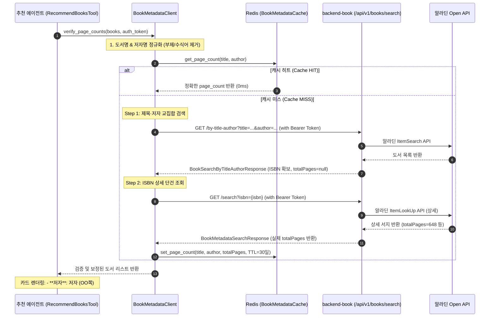

# 알라딘 도서 서지 검증 및 쪽수 실조회 파이프라인

## 1. 📌 개요 및 배경 (Problem & Solution)

### 문제점 (LLM 환각 및 부정확한 쪽수)
* 추천 에이전트(LLM + Tavily 웹 검색)가 실존 도서를 추천할 때, 페이지수(총 쪽수)는 웹 스니펫에 없거나 LLM의 사전 지식에 의존하여 **"약 300쪽", "350여 쪽"과 같은 근사치 표현이나 잘못된 숫자(Hallucination)**를 생성하는 문제가 발생합니다.
* 사용자가 독서 타이머를 시작하거나 완독 통계를 낼 때 잘못된 쪽수는 서비스의 신뢰도를 저하시킵니다.

### 해결책: 2단 알라딘 실조회 & 30일 Redis 캐시
* 추천 에이전트가 생성한 추천 도서 목록에 대해, `backend-book`이 보유한 알라딘 실조회 Open API를 2단(Two-step)으로 연동하여 **실제 출판된 책의 정확한 총 페이지수를 실시간으로 확보하고 보정**합니다.
* 외부 API 호출 비용 및 레이턴시를 최소화하기 위해 **Redis 기반 30일(2,592,000초) 장기 TTL 캐시**를 적용합니다.

---

## 2. 🏛️ 아키텍처 및 2단 조회 시퀀스 (Two-Step Verification Pipeline)

---

## 3. 🔍 핵심 구현 세부사항

### 1) 알라딘 검색 성공률을 극대화하는 정규화 함수
웹 검색으로 수집된 도서명과 저자명은 부제(`:`, `-`, `[개정판]`)나 역할어(`지음`, `외 2인`)가 붙어 있어 교집합 검색 시 매칭 실패율이 높습니다. `BookMetadataClient`는 이를 정제하는 순수 전처리 함수를 제공합니다:

* **`clean_title_for_search(title)`**:
  * 콜론(`:`), 대시(`-`), 슬래시(`/`) 기준 메인 제목만 추출.
  * 괄호류(`()`, `[]`, `<>`) 및 판본(`[개정판]`, `(양장본)`) 제거.
  * 예: `"사피엔스 : 유인원에서 사이보그까지 (개정판)"` ➔ `"사피엔스"`
* **`clean_author_for_search(author)`**:
  * 쉼표(`,`), 슬래시(`/`), `외`, `및` 기준 대표 저자 1인만 추출.
  * 후행 수식어(`지음`, `저자`, `저`, `글`, `원작`) 제거.
  * 예: `"유발 하라리 지음, 조현욱 옮김"` ➔ `"유발 하라리"`

### 2) 왜 2단(Two-step) 조회인가?
* `backend-book`의 `GET /api/v1/books/search/by-title-author`는 제목과 저자로 일치하는 도서의 **ISBN**을 안전하게 찾아주지만, 알라딘 목록 검색의 특성상 `totalPages`가 `null`로 응답됩니다.
* 반면 `GET /api/v1/books/search?isbn={isbn}`은 정확한 단건 상세 조회를 수행하여 `totalPages`(예: 사피엔스 648쪽, 백야행 592쪽)를 정확히 반환합니다.
* 따라서 `BookMetadataClient`는 `by-title-author ➔ search?isbn=`의 2단계 파이프라인을 비동기로 연결하여 완전한 쪽수를 확보합니다.

### 3) Bearer 인증 토큰 패스스루 & Graceful Degradation
* `backend-book`의 검색 API는 401 인증이 요구되므로, 클라이언트의 `Authorization` 헤더를 `RecommendBooksTool` ➔ `BookMetadataClient`로 투명하게 패스스루합니다.
* 토큰이 만료되었거나 네트워크 지연/타임아웃(기본 8초)이 발생하더라도 **에러를 외부로 전파(500)하지 않고 예외를 삼킨 뒤(`None` 반환) LLM의 원래 추정치를 유지**하는 Graceful Fallback 원칙을 준수합니다.

---

## 4. ⚡ 성능 최적화: 병렬 비동기 조회 & Redis 30일 캐시

* **비동기 동시 조회 (`asyncio.gather`)**:
  * 추천된 2~3권의 도서에 대해 순차(Sequential) 조회를 하지 않고 `asyncio.gather`로 병렬 호출하여 검증 구간 지연시간을 1개 도서 호출 시간 수준(약 40~80ms)으로 단축합니다.
* **30일 TTL 캐싱 (`BookMetadataCache`)**:
  * Redis Key: `book:metadata:{title}:{author}` (공백 및 특수문자 정규화)
  * 도서의 페이지수는 출판 후 거의 변경되지 않는 불변 데이터이므로 **30일(2,592,000초)** 동안 캐시합니다.
  * 캐시 히트 시 외부 네트워크 왕복 없이 0ms 수준으로 즉시 반환됩니다.
