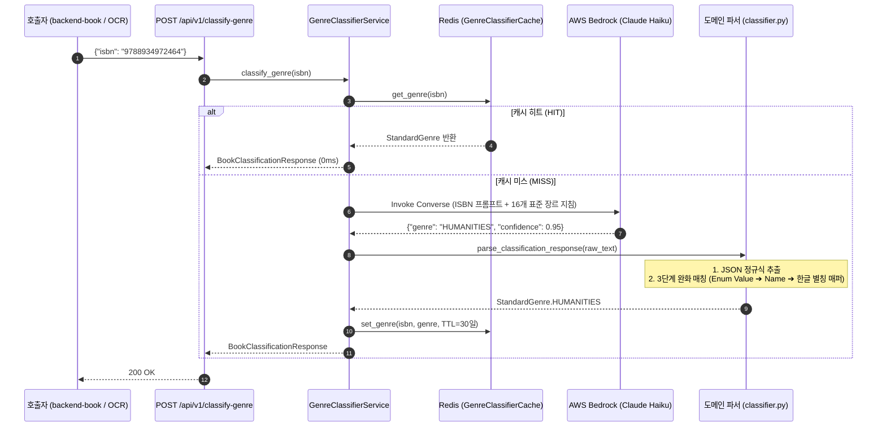

# 도서 16개 표준 장르 분류 및 캐싱 파이프라인 (Genre Classification Pipeline)

## 1. 📌 개요 및 배경

* **목적**: OCR 스캔이나 외부 도서 등록(알라딘 등) 시 수집되는 비정형 카테고리를 DPYB ERD 및 `backend-book` 규격의 **16개 표준 장르(`genre_type`) 중 단 1개로 정밀 분류** (`POST /api/v1/classify-genre`).
* **단일 식별자 기반**: ISBN 단일 필드(`BookClassificationRequest`)를 받아 제로샷 LLM 추론 및 규칙 기반 매퍼를 거쳐 표준 장르 Enum으로 확정합니다.

---

## 2. 📚 16개 표준 장르 Enum 규격

DB 테이블(`books.genre`)과 100% 일치하는 16개 표준 Enum입니다:

| 표준 Enum 값 | 분류 대상 및 주요 포함 분야 |
| :--- | :--- |
| `SCIENCE_FICTION` | SF, 공상과학, 사이버펑크, 스페이스 오페라 |
| `FANTASY` | 판타지, 무협, 다크판타지, 어반판타지, 로맨스판타지 |
| `ROMANCE` | 로맨스, 순정, 연애소설 |
| `MYSTERY_THRILLER` | 추리, 미스터리, 스릴러, 서스펜스, 공포, 범죄소설 |
| `LITERARY_FICTION` | 한국소설, 영미소설, 고전문학, 순수소설, 일반문학 |
| `ESSAY` | 수필, 산문집, 그림에세이, 일상/여행에세이 |
| `POETRY_DRAMA` | 시집, 희곡, 대본집, 시론 |
| `HUMANITIES` | 철학, 심리학, 윤리학, 언어학, 신화학, 고전인문 |
| `HISTORY` | 한국사, 세계사, 동양사, 서양사, 역사인물/사건 |
| `BUSINESS_ECONOMICS`| 경영학, 경제학, 마케팅, 재테크, 주식/투자, 비즈니스 |
| `SELF_HELP` | 성공/처세, 인간관계, 시간관리, 습관, 리더십, 자기계발 |
| `SCIENCE` | 자연과학, 수학, 물리학, 화학, 생명과학, 천문학 |
| `ARTS` | 미술, 음악, 디자인, 사진, 건축, 영화, 만화, 공예 |
| `RELIGION` | 기독교, 불교, 가톨릭, 종교일반, 신앙/명상 |
| `COMPUTER_IT` | 프로그래밍, 개발, IT교양, 컴퓨터공학, AI/데이터 |
| `NONE` | 미분류, 도서 정보 부족 또는 위 범주에 부합하지 않음 |

---

## 3. ⚙️ 분류 처리 파이프라인 및 아키텍처

---

## 4. 🛡️ 견고성(Robustness) 및 캐싱 최적화

1. **3단계 완화 매칭 엔진 (`match_standard_genre`)**:
   - LLM이 규격 외의 응답을 반환할 때를 대비하여 다계층 매칭을 수행합니다:
     - 1단계: Enum Value 완전 일치 (`"HUMANITIES"`)
     - 2단계: Enum Name 대소문자 무시 일치 (`"humanities"`)
     - 3단계: 별칭/동의어 매핑 테이블 (`"인문"`, `"철학"`, `"SF"`, `"추리소설"`, `"경영/경제"` 등 수십 종의 한글 별칭 내장)
2. **에러 격리 & Graceful Fallback**:
   - 알 수 없는 ISBN이거나 Bedrock 호출이 실패하더라도 시스템 예외(500)를 던지지 않고 `StandardGenre.NONE` (confidence: 0.0)으로 안전하게 반환합니다.
3. **Redis 30일(2,592,000초) 캐시 (`GenreClassifierCache`)**:
   - 동일한 ISBN에 대한 중복 LLM 추론을 영구에 가깝게 차단하여, 반복 요청 시 **비용 0원 및 레이턴시 < 5ms**를 보장합니다.
