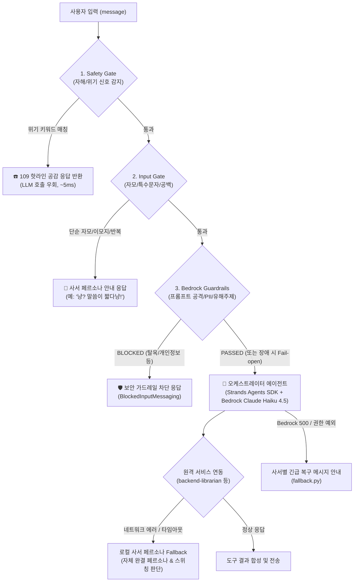

# 다계층 보안 게이트웨이 및 무중단 에러 복원 엔진 (Multi-Tier Safety & Fallback Engine)

## 1. 📌 개요 및 설계 철학

`backend-discovery`는 사용자 입력이 들어오는 순간부터 응답이 나갈 때까지, **보안 위험 차단 · 위기 상황 생명 보호 · 불필요한 LLM 비용 절감 · 외부 마이크로서비스 장애 격리**를 달성하기 위해 4단계의 인프로세스 사전 검증 게이트와 2단계 복원 Fallback 메커니즘을 운영합니다.

---

## 2. 🏛️ 요청 생명주기 및 4계층 게이트 파이프라인

사용자의 채팅 요청(`POST /api/v1/chat` 또는 스트리밍)은 아래 순서대로 게이트를 통과하며, 위배 시 **LLM 추론 비용(Bedrock)과 지연시간(TTFT)을 전혀 발생시키지 않고 초고속(~10ms) 조기 반환**됩니다:

---

## 3. 🛡️ 4계층 사전 검증 게이트 (Pre-flight Gates)

### Gate 1: 생명 보호 Safety Gate (`safety_gate.py`)
* **목적**: 자해, 자살, 극단적 심리 위기 신호를 감지하여 공인 위기상담전화(109 등) 핫라인을 즉시 안내.
* **동작 원리**:
  * `CRISIS_KEYWORDS_PATTERN` 정규식 기반 결정론적 판별.
  * **도서명 오탐 방지**: `자살론`, `자살가게`, `자살 토끼` 등 학술/문학 도서명 언급 시에는 게이트를 발동하지 않고 검색 에이전트로 정상 인입.
* **응답 속도**: ~5ms (LLM 완전 우회). 지연시간 통계 왜곡 방지를 위해 CloudWatch p50/p90 지표에서 제외.

### Gate 2: 입력 정제 Input Gate (`input_gate.py`)
* **목적**: `ㅋㅋㅋ`, `ㅎㅎ`, `??`, 단순 이모지, 숫자 1개 등 의미 없는 비정형 입력 차단.
* **효과**: LLM 토큰 낭비 방지, 응답 시간 단축.
* **응답 예시**: 블루(고양이) - *"냥? 어떤 책이나 이야기를 찾고 계신지 편하게 말씀해달라냥! 🐾"*

### Gate 3: Bedrock Guardrails Gate (`bedrock_guardrail_gate.py`)
* **목적**: OWASP LLM Top 10(프롬프트 인젝션, 탈옥), 개인정보(PII: 주민번호/전화번호/API Key) 노출, 시스템 프롬프트 탈취 원천 방어.
* **AWS IaC**: `docs/security/guardrail-stack.yaml`로 선언형 관리되는 Bedrock Guardrail (`apply_guardrail(source='INPUT')`).
* **High Availability**: AWS 네트워크 지연이나 Boto3 예외 발생 시 서비스 중단을 막기 위해 **Graceful Fail-open** 정책 적용.

---

## 4. 🔄 2단계 장애 복원 Fallback 메커니즘

### 1) 원격 사서 장애 격리: 로컬 페르소나 Fallback (`librarian_tool.py`)
* **상황**: `backend-librarian` 마이크로서비스가 배포 중이거나 일시적 타임아웃(기본 1.5초) 발생.
* **복구 동작**:
  * 통신 실패를 사용자에게 500 에러로 노출하지 않음.
  * `evaluate_local_persona_response()` 엔진이 활성화되어 **인프로세스에서 즉시 블루/슈빌 사서의 고유 말투(~다냥 🐾 / 두둥! 🪶)와 스위칭 판단을 결정론적으로 생성**.
  * 사용자 관점에서는 사서 서버가 다운되어 있어도 대화가 중단 없이 매끄럽게 이어짐.

### 2) Bedrock LLM 런타임 장애 Fallback (`fallback.py`)
* **상황**: AWS Bedrock 리전 장애, Throttling, 일시적 크레덴셜 만료.
* **복구 동작**:
  * `get_llm_fallback_message(librarian_id)` 호출.
  * 고양이 사서: *"냥냥... 서재 책장을 정리하던 중에 통신 연결이 잠시 끊겼다냥 🐾 잠시 후에 다시 이야기해달라냥!"*
  * 황새 사서: *"두둥! 서재 사서실 통신에 일시적인 장애가 발생했습니다 🪶 잠시 후 다시 말씀해 주십시오."*
  * 정중하고 캐릭터성이 살아있는 메시지로 사용자 경험(UX) 훼손을 최소화.
