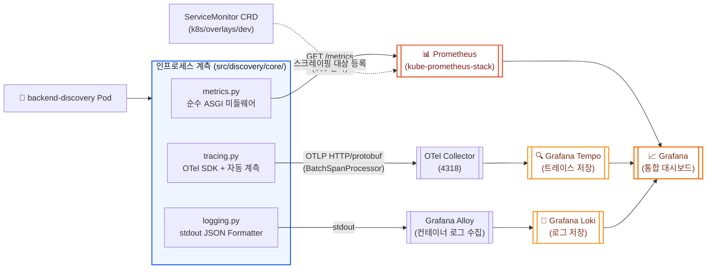

# Prometheus / Grafana(Tempo) / Loki 관측 스택 운영 가이드

본 문서는 `backend-discovery`의 **HTTP 메트릭(Prometheus), 분산 트레이싱(OpenTelemetry ➔ Tempo), 구조화 로그(Loki)** 3대 관측 축을 어떻게 계측·수집·상관분석하는지 안내합니다. AWS CloudWatch(비용/토큰/LLM 전용 커스텀 메트릭)는 [CloudWatch 대시보드 가이드](cloudwatch-dashboard-guide.md)에서 별도로 다루며, 본 문서는 그와 **완전히 분리된** infra 공용 관측 스택(`dont-paw-get/infra`)을 대상으로 합니다.

---

## 1. 📌 개요 및 설계 철학

* **목적**:
  * **일관된 알림 규칙 재사용**: Spring 기반 타 서비스와 동일한 메트릭 이름을 노출해 `infra` 리포지토리의 Prometheus 알림 규칙(p99 레이턴시, 5xx 에러율)을 수정 없이 그대로 적용
  * **3-way Correlation**: 메트릭 ↔ 트레이스 ↔ 로그를 `application`/`service.name`/`trace_id` 공통 키로 상호 연결해 장애 원인(RCA)을 신속히 추적
  * **Zero-Cost 기본값**: OTel Collector 엔드포인트가 설정되지 않은 로컬 환경에서는 exporter 없이도 앱이 정상 기동 (no-op)
* **역할 분리**: Prometheus는 "얼마나 느렸는가/얼마나 실패했는가"(지표), Tempo는 "어디서 시간이 걸렸는가"(분산 추적), Loki는 "무슨 일이 있었는가"(로그 원문)를 담당합니다.

---

## 2. 🏛️ 관측 데이터 흐름 아키텍처



---

## 3. 📊 Prometheus HTTP 메트릭 (`core/metrics.py`)

### 3.1 메트릭 명세

* **메트릭 이름**: `http_server_requests_seconds` (Histogram)
* **호환성**: Spring Micrometer가 노출하는 이름과 구조를 그대로 모방하여 `infra`의 기존 알림 규칙을 그대로 재사용합니다.
* **Labels**:

| 라벨 | 설명 | 예시 |
| :--- | :--- | :--- |
| `method` | HTTP 메서드 | `POST` |
| `uri` | Path 파라미터를 `{name}` 템플릿으로 정규화한 경로 (카디널리티 최소화) | `/api/v1/chat` |
| `status` | HTTP 상태 코드 | `200` |
| `outcome` | 상태 코드 계열 (Micrometer 호환) | `SUCCESS`, `CLIENT_ERROR`, `SERVER_ERROR` |
| `application` | 서비스 식별자. `OTEL_SERVICE_NAME` 환경 변수에서 읽어 트레이스 `service.name`과 강제 일치 | `backend-discovery` |

* **Latency Buckets**: `0.05 ~ 60.0`초 (LLM 스트리밍 응답이 30~40초대에 이르는 특성을 고려해 Prometheus 기본 상한(10초)보다 넓게 확장)
* **계측 제외 경로**: `/metrics`, `/health`, `/api/v1/health` (probe·스크레이핑 자체는 계측하지 않음)
* **스트리밍 대응**: `BaseHTTPMiddleware`가 아닌 **순수 ASGI 미들웨어**로 구현되어, 스트리밍 응답의 마지막 body 청크까지의 wall-clock 시간을 정확히 계측합니다.

### 3.2 엔드포인트 노출

* **경로**: `GET /metrics`
* **포맷**: Prometheus text exposition format (`prometheus_client.generate_latest()`)

### 3.3 Kubernetes 스크레이핑 등록 (`ServiceMonitor`)

`k8s/overlays/dev/servicemonitor.yaml`로 `infra`의 `kube-prometheus-stack`이 자동으로 이 서비스를 스크레이핑 대상에 등록합니다.

```yaml
apiVersion: monitoring.coreos.com/v1
kind: ServiceMonitor
metadata:
  name: backend-discovery
  labels:
    app.kubernetes.io/name: backend-discovery
spec:
  selector:
    matchLabels:
      app.kubernetes.io/name: backend-discovery
  endpoints:
    - port: http          # base Service의 포트 이름 (port 80 → targetPort http=8000)
      path: /metrics
      interval: 30s
```

> ⚠️ **prod overlay에는 두지 않습니다.** prod 클러스터에는 ServiceMonitor CRD(Prometheus Operator)가 설치되어 있지 않아, base에 두면 ArgoCD sync가 실패합니다. dev overlay에만 리소스로 추가되어 있습니다.

---

## 4. 🔍 OpenTelemetry 분산 트레이싱 (`core/tracing.py`) ➔ Grafana Tempo

### 4.1 초기화 정책

* **조건부 Exporter**: `OTEL_EXPORTER_OTLP_ENDPOINT`(또는 `_TRACES_ENDPOINT`) 환경 변수가 설정된 경우에만 OTLP HTTP/protobuf Exporter를 `BatchSpanProcessor`로 연결합니다. 미설정 시에도 `TracerProvider`는 세팅되어 Collector 없는 로컬 환경에서도 정상 실행됩니다.
* **표준 환경 변수 기반 제어**: 샘플러(`OTEL_TRACES_SAMPLER`, `OTEL_TRACES_SAMPLER_ARG`), 서비스명(`OTEL_SERVICE_NAME`), 리소스 속성(`OTEL_RESOURCE_ATTRIBUTES`)은 OTel SDK 표준 환경 변수로 제어되며 코드에 하드코딩하지 않습니다.
* **전파(Propagation)**: W3C Trace Context + Baggage. 다른 백엔드(`backend-librarian`, `backend-book`)가 보낸 `traceparent` 헤더를 FastAPI 자동 계측이 이어받아 동일 Trace로 연결합니다.

### 4.2 자동 계측 대상

| 라이브러리 | 계측 대상 |
| :--- | :--- |
| `FastAPIInstrumentor` | 서버 span 생성 (health probe 경로 제외) |
| `RedisInstrumentor` | `ChatSessionStore` Redis 호출 |
| `BotocoreInstrumentor` | AWS Bedrock(Converse API) 호출 포함 |
| `HTTPXClientInstrumentor` | `backend-librarian`/`backend-book` HTTP 호출 및 Tavily SDK 내부 호출 |
| Strands Agents SDK | 전역 `TracerProvider`를 자동 인식해 agent/cycle/tool/model span을 자체 생성 |

### 4.3 민감 정보 스크러빙 (`_SanitizingSpanExporter`)

Strands Agent tracer는 프롬프트·응답 원문을 span attribute/event에 실어 보내므로, Exporter 앞단에 **Sanitizing Wrapper**를 두어 다음을 제거·마스킹합니다:

* **제거되는 attribute 키**: `gen_ai.prompt`, `gen_ai.completion`, `gen_ai.input.messages`, `system_prompt` 등 프롬프트·응답 원문류 전체
* **URL Query 제거**: `url.full`, `http.url` 등에서 query string(검색어/필터) 제거
* **길이 백스톱**: 400자 초과 문자열 attribute는 `[redacted:N chars]`로 대체 (예외/코드 관련 필드는 예외)
* **Span Event 제거**: `exception` 이벤트를 제외한 나머지 이벤트(프롬프트 원문이 담기는 이벤트 등) 전체 제거

> AI observability는 프롬프트 원문이 아니라 **구조/메트릭 정보 중심**으로 운영하는 것이 설계 원칙입니다.

### 4.4 트레이싱 제외 경로

`health`, `healthz`, `readyz`, `livez`, `metrics` — k8s probe 및 Prometheus 스크레이핑 경로는 트레이스 대상에서 제외됩니다.

---

## 5. 📜 구조화 JSON 로깅 (`core/logging.py`) ➔ Grafana Loki

### 5.1 수집 방식

* **Loki Client 미사용**: Grafana Alloy가 컨테이너 **stdout**을 직접 수집해 Loki로 전달하므로, 애플리케이션 코드에는 Loki 전송 클라이언트를 두지 않습니다.
* **로그 한 줄 = JSON 한 개**: 모든 로그 레코드는 `JsonLogFormatter`를 통해 단일 JSON 라인으로 직렬화되어 stdout에 출력됩니다.
* **파일 핸들러 없음**: Pod 내부에 로그 파일을 남기지 않습니다.

### 5.2 최소 필드 스키마

| 필드 | 설명 |
| :--- | :--- |
| `timestamp` | ISO 8601 (밀리초 단위, UTC) |
| `level` | 로그 레벨 (`INFO`, `WARNING`, `ERROR` 등) |
| `service` | 서비스명 |
| `logger` | 로거 이름 |
| `message` | 로그 메시지 |
| `trace_id` / `span_id` | 현재 활성 OTel Span Context에서 주입 — **Loki ↔ Tempo Correlation의 핵심 키** |
| `exception` | 예외 스택트레이스 (발생 시) |

> `trace_id`/`span_id`는 high-cardinality 값이므로 **Loki label로 승격하지 않고 JSON 필드로만 유지**합니다 (label 승격은 Alloy 수집 설정 쪽 책임).

### 5.3 PII·민감정보 마스킹

`extra` 컨텍스트로 로그에 흘러들어오는 값 중 아래 키 패턴이 포함되면 값을 `[REDACTED]`로 마스킹합니다:

```text
authorization, auth_token, token, access_token, refresh_token, id_token, cookie,
api_key, apikey, secret, password, credential, aws_access_key, aws_secret,
session_token, prompt, system_prompt, message_text, query_text, answer,
response_body, request_body
```

### 5.4 로거 레벨 정책

* `discovery` 애플리케이션 로거: 항상 `INFO` 이상 관측 (uvicorn 기본 effective level에 영향받지 않도록 명시적 설정)
* `uvicorn.access`: `WARNING`으로 억제 (FastAPI 자동 계측 서버 span과 내용이 중복되므로)

---

## 6. ⚙️ 환경 변수 및 배포 설정

| 변수명 | 설명 | 비고 |
| :--- | :--- | :--- |
| `OTEL_SERVICE_NAME` | 트레이스 `service.name` 및 Prometheus `application` 라벨에 공통 사용 | 미설정 시 기본값 `backend-discovery` |
| `OTEL_EXPORTER_OTLP_ENDPOINT` / `_TRACES_ENDPOINT` | OTel Collector 엔드포인트(4318) | 미설정 시 트레이싱은 export 없이 no-op |
| `OTEL_TRACES_SAMPLER` / `OTEL_TRACES_SAMPLER_ARG` | 샘플링 정책 | OTel SDK 표준 (기본값 `parentbased_always_on`) |
| `OTEL_RESOURCE_ATTRIBUTES` | 추가 리소스 속성 | 선택 |

관측 설정값은 비밀이 아니므로 `k8s/base/configmap.yaml` 및 `k8s/overlays/dev/configmap-patch.yaml`(환경별 값)에 위치합니다. `ENABLE_CLOUDWATCH_METRICS`(CloudWatch 전용)와는 독립적으로 항상 계측되며, OTLP Endpoint 미설정 시에도 Prometheus `/metrics`와 JSON stdout 로깅은 그대로 동작합니다.

---

## 7. 🛠️ 점검 및 트러블슈팅

1. **Prometheus에 메트릭이 안 잡히는 경우**:
   * `ServiceMonitor`의 `selector.matchLabels`가 base `Service`의 라벨(`app.kubernetes.io/name: backend-discovery`)과 일치하는지 확인합니다.
   * dev overlay에만 `servicemonitor.yaml`이 리소스로 등록되어 있으므로, prod에서는 정상적으로 스크레이핑되지 않습니다 (설계 의도).
2. **Tempo에 트레이스가 안 보이는 경우**:
   * `OTEL_EXPORTER_OTLP_ENDPOINT`가 해당 환경(overlay)의 ConfigMap patch에 실제로 주입되어 있는지 확인합니다. 미설정 시 앱은 정상 기동하지만 export를 전혀 수행하지 않습니다.
3. **Loki 로그와 Tempo 트레이스가 서로 연결되지 않는 경우**:
   * 로그 JSON의 `trace_id`가 `null`이면 해당 로그가 활성 Span Context 바깥(예: 앱 기동 시점)에서 기록된 것입니다. 요청 처리 중 로그인지 확인합니다.
4. **`http_server_requests_seconds`의 `uri` 라벨 카디널리티가 과도하게 증가하는 경우**:
   * 라우터에 매칭되지 않은 요청(404 등)은 `uri="NO_ROUTE"`로 고정되어 있어야 합니다. path 파라미터가 `{name}` 형태로 정규화되지 않고 실제 값으로 남아있다면 `_normalize_uri`의 `path_params` 바인딩을 확인합니다.
5. **uvicorn access 로그가 중복으로 보이지 않는 이유**:
   * `uvicorn.access` 로거가 `WARNING` 레벨로 억제되어 있으며, 동일 정보는 FastAPI 자동 계측 서버 span(Tempo) 및 `http_server_requests_seconds`(Prometheus)로 대체됩니다 (정상 동작).
